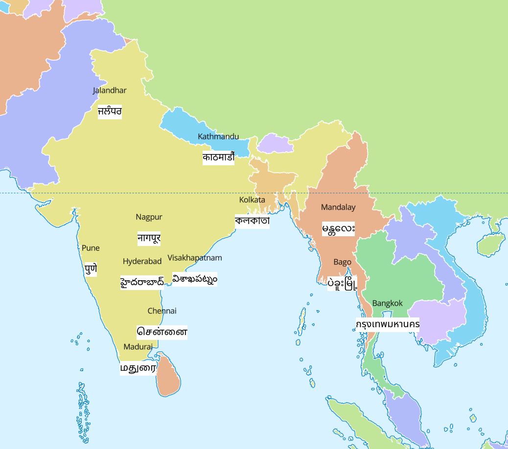

# i18n-testsuite-maplibre
A set of labels in languages that MapLibre GL JS cannot render.

The file `test.geojson` has a few cities in India and South-East Asian contries with the English name stored in the `name` property and a native name stored in the `native_name` property.

MapLibre GL JS can currently (v3.3.1) not render any of the `native_name`s.

To show the expected label, we add a canvas-generated image below the label which is generated by MapLibre GL JS.

## Demo

https://wipfli.github.io/i18n-testsuite-maplibre

